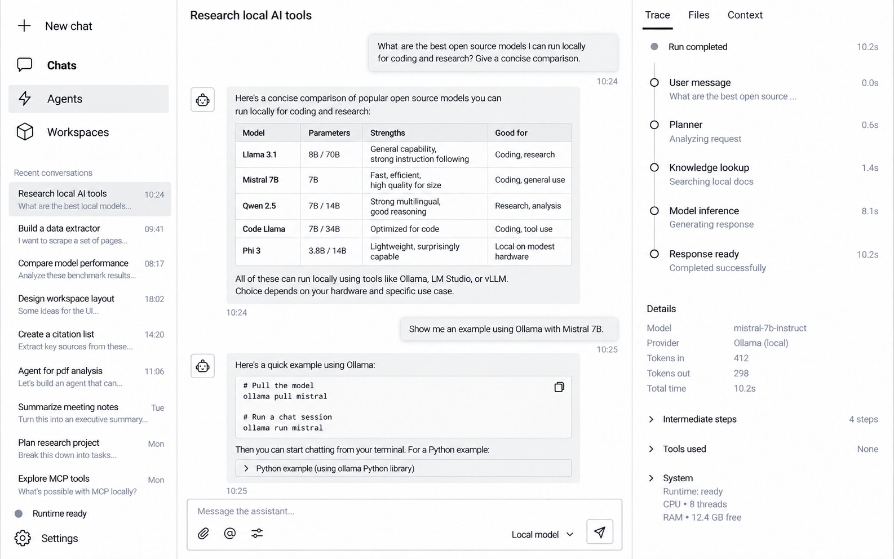

# AppRail and AppSidebar

Status: draft.

## Concept



The concept image communicates hierarchy and density. The written tokens and behavior in this document are authoritative for implementation: every region uses a white background, interaction states use neutral gray only, gradients and decorative shadows are not used, and corner radii remain restrained. The only elevated surface is the user-message bubble defined by the Chat page specification.

`AppSidebar` is the complete left region. `AppRail` is its stable navigation section, while the contextual list directly below it changes with the active page. There is no separate list column between the sidebar and workspace.

## Content

The AppSidebar has no brand mark or product-name header. Content is ordered as follows:

1. `New chat` action.
2. `Chats` navigation item.
3. `Agents` navigation item.
4. `Workspaces` navigation item.
5. Spacing break without a horizontal rule.
6. Contextual list for the active page, such as recent conversations.
7. Flexible empty space when the contextual list is short.
8. Runtime status.
9. `Settings` navigation item.

Every actionable row displays a Radix icon and a visible text label. Because labels are always visible, tooltips are not required for normal operation.

AppRail rows do not expose a visible container at rest. Their background, border, and shadow remain transparent until pointer hover. This applies to `New chat`, every route, and `Settings`; the active route is communicated by stronger text and icon weight instead of a persistent filled container. The contextual list below the AppRail has its own selection treatment and is not covered by this rule.

## Visual tokens

The AppSidebar and AppRail follow the shared [Visual system](../foundations/visual-system.md).

```css
--app-sidebar-background: var(--surface-primary);
--app-sidebar-border: var(--border-default);
--app-rail-background: var(--surface-primary);
--app-rail-text: var(--text-secondary);
--app-rail-text-strong: var(--text-primary);
--app-rail-hover: var(--surface-hover);
--app-rail-focus: var(--focus-default);
```

Geometry:

```css
--app-sidebar-width: clamp(240px, 22vw, 288px);
--app-rail-padding: 12px;
--app-rail-item-height: 44px;
--app-rail-item-gap: 6px;
--app-rail-item-padding-inline: 12px;
--app-rail-icon-size: 18px;
--app-rail-icon-label-gap: 12px;
--app-rail-item-radius: var(--radius-sm);
--app-sidebar-context-row-min-height: 56px;
```

The AppSidebar container radius is intentionally not assigned yet. It should be evaluated in the real Electron window using the shared radius scale rather than fixed in the initial implementation.

## Interaction states

| State | Background | Text and icon | Behavior |
| --- | --- | --- | --- |
| Default | Transparent | Charcoal | No visible container |
| Hover | Light gray | Black | Reveals the only filled row container with a 120ms color transition |
| Active | Transparent | Black, semibold | Uses `aria-current="page"`; no persistent container |
| Focus | Transparent with visible outline | State color | Keyboard-visible outline without a filled container |
| Disabled | Transparent | Light gray | No pointer response |
| New chat | Transparent | Black | Same resting treatment as other actions |

Hover reveals the restrained rounded surface without translating, scaling, adding a border, or adding a shadow. An active row may show the same hover surface while pointed, but returns to transparent when the pointer leaves.

```css
.app-rail-item {
  background: transparent;
  border: 0;
  box-shadow: none;
}

.app-rail-item:hover {
  background: var(--app-rail-hover);
}

.app-rail-item--active {
  background: transparent;
  color: var(--app-rail-text-strong);
  font-weight: 600;
}
```

## Contextual list

The contextual list belongs to the active top-level page:

- `Chats`: recent conversations.
- `Agents`: available and recently used agents.
- `Workspaces`: available workspaces.
- `Settings`: setting categories when required.

Only this area scrolls. The AppRail above it and the footer below it remain visible. Empty, loading, and error states occupy this same area instead of creating a new column.

## Runtime status

Runtime status is informational rather than a primary route. It uses a neutral gray status mark and an explicit text label:

- Solid dark-gray dot: `Runtime ready`.
- Gray outlined dot: `Runtime busy`.
- Light-gray crossed dot: `Runtime unavailable`.

The status row may become clickable when a runtime-details Inspector exists. Until then it remains non-interactive.

## Navigation model

```ts
export type AppPage = "chat" | "agents" | "workspaces" | "settings";

export type RuntimeStatus = "ready" | "busy" | "unavailable";
```

`New chat` is an action, not a page. It creates a session and navigates to `chat`.

Navigation configuration belongs to the renderer because it contains React icon components. It must not be placed in Electron IPC contracts or shared runtime packages.

## React boundary

The initial implementation uses one shell component with small rendering boundaries:

```text
AppSidebar
|-- AppRail
|   `-- AppRailItem
|-- SidebarContext
`-- AppSidebarFooter
```

```ts
interface AppSidebarProps {
  activePage: AppPage;
  activeContextId?: string;
  contextItems: SidebarContextItem[];
  runtimeStatus: RuntimeStatus;
  onNavigate(page: AppPage): void;
  onSelectContext(id: string): void;
  onNewConversation(): void;
}

interface SidebarContextItem {
  id: string;
  title: string;
  description?: string;
}

interface AppRailItemProps {
  label: string;
  icon: IconComponent;
  active?: boolean;
  disabled?: boolean;
  onClick(): void;
}
```

The AppSidebar owns rendering and its contextual scroll area only. Page state, list loading, and new-session creation remain in the application shell or page feature.

## File placement

```text
apps/desktop/src/renderer/app/
  App.tsx
  AppShell.tsx
  AppSidebar.tsx
  AppRail.tsx
  SidebarContext.tsx
  navigation.ts
  app-shell.css
```

CSS class names:

```text
.app-sidebar
.app-sidebar__context
.app-sidebar__footer
.app-rail
.app-rail__new-chat
.app-rail__navigation
.app-rail__runtime
.app-rail-item
.app-rail-item--active
.app-rail-item--disabled
.app-rail-item__icon
.app-rail-item__label
.app-rail-runtime-dot
```

## Accessibility

- Navigation uses a `nav` element with an accessible label.
- Each item is a real `button` and includes an `aria-label` matching its visible label.
- The selected route uses `aria-current="page"`.
- Decorative icons use `aria-hidden="true"`.
- Focus indication must not depend on color alone.
- Status mark is always paired with status text.
- The contextual list uses the semantic pattern appropriate to its content rather than pretending to be global navigation.
- Motion respects `prefers-reduced-motion`.

## Deferred decisions

The following are intentionally excluded from the first AppSidebar implementation:

- User avatar or account menu.
- Navigation badges and unread counts.
- Drag-to-resize behavior.
- User-reordered navigation.
- Collapsed icon-only mode.
- Runs, Tools, Papers, or Experiments as top-level routes.
- Final AppSidebar container radius.
